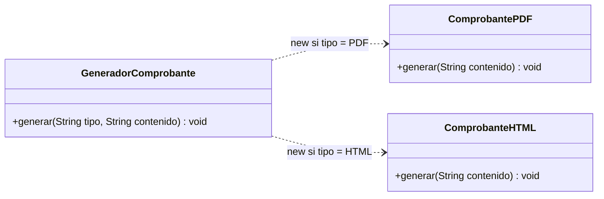
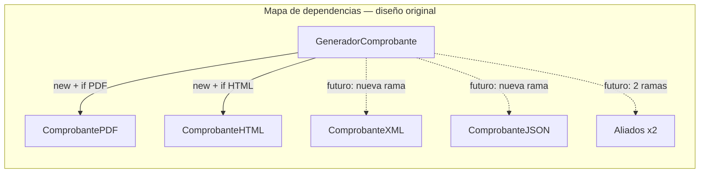
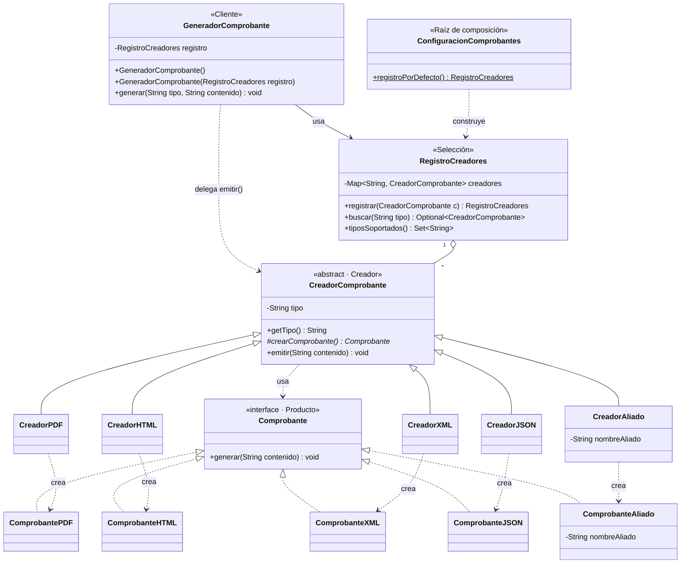
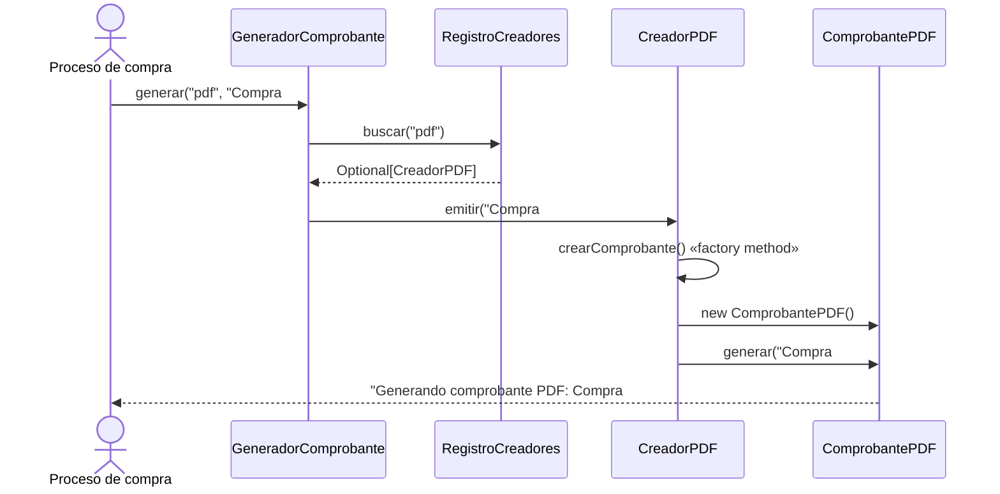
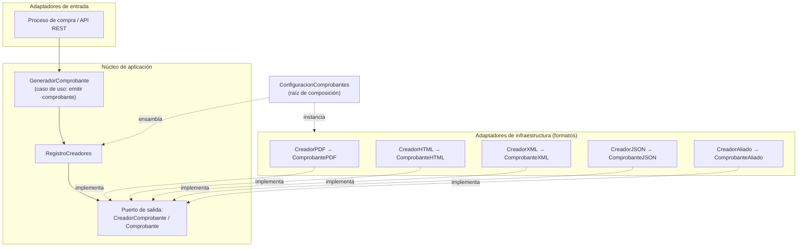

# Caso 1 — Sistema multicanal de generación de comprobantes (MercadoRegional)

**Actividad:** R1-A2-S7 Patrones de arquitectura — Patrones GoF como soporte al diseño interno de componentes
**Categoría GoF del caso:** Creacional · **Patrón seleccionado:** Factory Method (con registro de creadores)
**Marco de calidad de referencia:** ISO/IEC 25010:2023 (modelo de calidad del producto) e ISO/IEC 25023 (medición)

> **Pregunta orientadora:** ¿Cómo desacoplar la creación de diferentes tipos de comprobantes para permitir que el sistema incorpore nuevos formatos con un impacto mínimo sobre el código existente?

**Respuesta corta:** separando *quién decide qué comprobante crear* de *quién coordina la generación*. Cada formato encapsula su propia creación en un **creador concreto** (Factory Method). El coordinador obtiene el creador desde un **registro** y trabaja solo con abstracciones. Así, agregar XML, JSON o formatos de aliados **no modifica** `GeneradorComprobante`.

---

## Índice

1. [Análisis inicial](#1-análisis-inicial)
2. [Diagnóstico de diseño](#2-diagnóstico-de-diseño)
3. [Principios de diseño aplicables](#3-principios-de-diseño-aplicables)
4. [Alternativas y decisión fundamentada](#4-alternativas-y-decisión-fundamentada)
5. [Diseño propuesto](#5-diseño-propuesto)
6. [Implementación y trazabilidad](#6-implementación-y-trazabilidad)
7. [Validación con pruebas JUnit](#7-validación-con-pruebas-junit)
8. [Evaluación del impacto](#8-evaluación-del-impacto)
9. [Conexión arquitectónica y atributos de calidad](#9-conexión-arquitectónica-y-atributos-de-calidad)
10. [Respuestas a las preguntas de reflexión](#10-respuestas-a-las-preguntas-de-reflexión)

---

## 1. Análisis inicial

### 1.1 Funcionamiento actual

El módulo recibe un **tipo** de comprobante (texto) y el **contenido** de la compra. `GeneradorComprobante.generar(tipo, contenido)` compara el tipo con `"PDF"` y `"HTML"` (sin distinguir mayúsculas). Según el resultado, **instancia directamente** la clase del formato y le pide generar el comprobante. La generación está simulada con un mensaje en consola. Si el tipo no coincide, lanza `IllegalArgumentException("Tipo de comprobante no soportado")`.

### 1.2 Clases, responsabilidades y dependencias

| Clase | Responsabilidades | Depende de |
|---|---|---|
| `GeneradorComprobante` | (1) Interpretar el texto `tipo`. (2) Decidir qué clase concreta crear. (3) Instanciarla con `new`. (4) Invocar la generación. (5) Rechazar tipos no soportados. | `ComprobantePDF`, `ComprobanteHTML` (clases concretas) |
| `ComprobantePDF` | Generar el comprobante PDF (simulado con `System.out`). | `System.out` |
| `ComprobanteHTML` | Generar el comprobante HTML (simulado con `System.out`). | `System.out` |

*(Versión PlantUML: `docs/uml/diseno-original.puml`)*

### 1.3 Comportamiento observable (línea base)

Antes de modificar el código se documentó su comportamiento real, incluidos los bordes, con 10 pruebas de caracterización (`CaracterizacionGeneradorComprobanteTest`):

| Entrada | Resultado observado |
|---|---|
| `("PDF", "Compra #1001")` | Imprime `Generando comprobante PDF: Compra #1001` |
| `("HTML", "Compra #1002")` | Imprime `Generando comprobante HTML: Compra #1002` |
| `("pdf", …)`, `("HtMl", …)` | Funciona: no distingue mayúsculas |
| Contenido `""` | Imprime el mensaje con el contenido vacío |
| Contenido `null` | No falla; imprime la palabra `null` |
| `("TXT", …)`, `("", …)` | `IllegalArgumentException` con mensaje exacto; no imprime nada |
| `(" PDF ", …)` | No soportado: el tipo **no se recorta** |
| Tipo `null` | `NullPointerException` |

> Los dos últimos comportamientos son discutibles, pero **se conservan**: la refactorización no debe cambiar el comportamiento. Si se quieren cambiar, debe hacerse como un requisito aparte y con pruebas propias.

---

## 2. Diagnóstico de diseño

### 2.1 Code smells identificados

| ID | Code smell | Ubicación | Evidencia | Consecuencia sobre mantenibilidad/evolución |
|---|---|---|---|---|
| CS1 | **Condicionales encadenados por tipo** (*Switch Statements*) | `GeneradorComprobante.generar`, cadena `if / else if / else` | `tipo.equalsIgnoreCase("PDF")`, `tipo.equalsIgnoreCase("HTML")` | Cada formato nuevo agrega una rama. La complejidad ciclomática crece en +1 por formato (3 hoy, 7 tras los 4 formatos previstos). |
| CS2 | **Dependencia rígida de clases concretas** | Mismo método | `new ComprobantePDF()`, `new ComprobanteHTML()` | El coordinador conoce y crea cada implementación, así que no se puede sustituir una implementación sin editarlo. |
| CS3 | **Obsesión por primitivos / cadenas mágicas** | Parámetro `String tipo` y literales `"PDF"`, `"HTML"` | El catálogo de tipos válidos existe solo como literales dentro del `if` | Los errores de digitación solo aparecen en ejecución y no hay forma de consultar qué formatos existen. |
| CS4 | **Falta de abstracción común y duplicación** | `ComprobantePDF`, `ComprobanteHTML` y cada rama del `if` | Ambas clases tienen el mismo método `generar(String)`, pero no comparten tipo. El bloque "crear + llamar `generar`" se repite en cada rama. | No hay polimorfismo posible, y el patrón repetido se copia con cada formato nuevo. |
| CS5 | **Cambio divergente** (*Divergent Change*) | `GeneradorComprobante` | La clase cambia al agregar un formato, al cambiar la regla de selección o al cambiar el flujo de generación | Viola SRP: varias razones de cambio en una sola clase y riesgo de regresión en PDF/HTML cada vez que se toca. |
| CS6 | **Responsabilidades mezcladas** | `GeneradorComprobante` | Decide, crea y usa el comprobante en el mismo método | La creación y el uso no pueden evolucionar por separado. |
| CS7 | **Baja capacidad de prueba** | Todo el módulo | Los métodos son `void`, escriben en `System.out` y hacen `new` internos | El coordinador solo se puede verificar capturando la consola. No se puede aislar con un doble de prueba. |
| CS8 | **Paquete por defecto** (menor) | Todos los archivos | Las clases no declaran `package` | Limita la modularidad: no se pueden importar desde otros paquetes. Se deja como recomendación (ver §8.4) para no alterar la línea base. |

### 2.2 Causas del acoplamiento

**Pregunta central: ¿qué cambio futuro provocaría modificaciones en varias partes?** Justamente el cambio anunciado. En seis meses llegan **XML, JSON y dos formatos de aliados**: cuatro cambios, y **cada uno obliga a abrir `GeneradorComprobante`**. Esto se comprobó de forma experimental en la rama `caso1-demo-xml-sin-patron` (§8.2).

Las causas son cuatro:

1. **El conocimiento del catálogo de formatos vive dentro del coordinador.** Qué formatos existen y cómo se crean está escrito en el `if`.
2. **La creación y el uso están en el mismo lugar.** El coordinador hace `new` de cada formato.
3. **No existe un contrato (interfaz)** que permita tratar a todos los comprobantes por igual.
4. **La selección se hace por texto**, con literales repetidos, en vez de un mecanismo de registro.

Todas las flechas salen del coordinador hacia clases **concretas**, y cada formato nuevo agrega una flecha más al mismo punto.

---

## 3. Principios de diseño aplicables

| Principio | Cómo se viola hoy | Qué orienta la mejora |
|---|---|---|
| **Abierto/Cerrado (OCP)** — *principal* | Para extender (nuevo formato) hay que modificar `GeneradorComprobante`. | El coordinador debe quedar cerrado a cambios y abierto a extensión mediante clases nuevas. |
| **Inversión de dependencias (DIP)** | El módulo de alto nivel (coordinador) depende de detalles (`ComprobantePDF`, `ComprobanteHTML`). | Ambos deben depender de abstracciones: `Comprobante` y `CreadorComprobante`. |
| **Responsabilidad única (SRP)** | El coordinador decide, crea y usa (CS5, CS6). | Crear → creadores. Seleccionar → registro. Coordinar → generador. Declarar formatos activos → configuración. |
| **Programar contra interfaces** | No existe una interfaz común (CS4). | Introducir `Comprobante` como contrato. |
| **Encapsular lo que varía** | Lo que varía (el formato) está mezclado con lo estable (el flujo). | Aislar la variación en creadores/productos concretos. |
| **Composición sobre herencia** | — | El coordinador **compone** un registro de creadores en lugar de tener subclases por formato (alternativa A5 descartada). |

---

## 4. Alternativas y decisión fundamentada

### 4.1 Alternativas consideradas

| ID | Alternativa | Descripción breve |
|---|---|---|
| A1 | Mantener el diseño y agregar `else if` | Una rama por formato nuevo. |
| A2 | `switch` sobre un `enum TipoComprobante` | Elimina las cadenas mágicas, pero el `switch` sigue en el coordinador. |
| A3 | Interfaz `Comprobante` + condicional en el coordinador | Hay polimorfismo en el uso, pero la creación sigue en el `if`. |
| A4 | *Simple Factory* (clase `FabricaComprobantes` con `switch`) | Mueve el condicional a otra clase. Es un idioma, no un patrón GoF. |
| A5 | Herencia: subclases del coordinador (`GeneradorPDF`, …) | El cliente tendría que saber qué subclase usar, y crece la jerarquía del coordinador. |
| A6 | Mapa `Map<String, Supplier<Comprobante>>` con lambdas | Mecanismo del lenguaje. Registro liviano sin clases creadoras. |
| **A7** | **Factory Method + registro de creadores** | **Cada formato tiene un creador concreto. El coordinador busca el creador en un registro inyectado.** |
| A8 | Abstract Factory | Crea *familias* de objetos relacionados. |
| A9 | `ServiceLoader` (SPI) o contenedor DI (Spring) | Descubrimiento automático de implementaciones o inyección por framework. |

### 4.2 Matriz comparativa ponderada

Escala 1 (peor) a 5 (mejor). En **complejidad introducida**, 5 = introduce muy poca complejidad.

| Criterio (peso) | A1 | A2 | A3 | A4 | A5 | A6 | **A7** | A8 | A9 |
|---|---|---|---|---|---|---|---|---|---|
| Acoplamiento (25 %) | 1 | 1 | 2 | 3 | 3 | 4 | **5** | 5 | 5 |
| Extensibilidad (25 %) | 1 | 2 | 2 | 2 | 3 | 4 | **5** | 3 | 5 |
| Mantenibilidad (20 %) | 2 | 3 | 3 | 3 | 3 | 4 | **5** | 3 | 4 |
| Testabilidad (15 %) | 2 | 2 | 3 | 3 | 3 | 4 | **5** | 4 | 4 |
| Complejidad introducida (15 %) | 5 | 5 | 4 | 4 | 3 | 4 | **3** | 2 | 1 |
| **Puntaje ponderado** | 1,95 | 2,40 | 2,65 | 2,90 | 3,00 | 4,00 | **4,70** | 3,50 | 4,05 |

### 4.3 Análisis de las alternativas más cercanas

- **A1–A4** mueven o renombran el problema, pero el `if/switch` sigue existiendo y **algo estable debe modificarse con cada formato**. Violan OCP.
- **A5** usa herencia donde basta la composición. Además, el cliente seguiría necesitando un condicional para escoger la subclase.
- **A8 (Abstract Factory)** no aplica. El caso no tiene *familias* de productos relacionados, solo una familia de un producto (el comprobante). Agregaría una interfaz de fábrica que cambiaría con cada producto nuevo.
- **A9** resuelve muy bien la extensibilidad, pero introduce un framework o metadatos (`META-INF/services`) desproporcionados para el tamaño del módulo. Queda como **evolución natural** (§8.4).
- **A6 (lambdas)** es la competidora real y una opción válida. Se prefirió A7 por tres razones concretas:
  1. **Los formatos de aliados necesitan configuración propia** (nombre del aliado, y en la práctica plantilla, NIT o código de convenio). Un **objeto creador** la guarda de forma explícita y probada (`CreadorAliado`), y **un mismo creador sirve para varios aliados**.
  2. El creador **transporta su metadato** (`getTipo()`), así que el registro no depende de claves escritas a mano en otro lugar.
  3. Los roles quedan **explícitos y documentados** (Creador, Producto, Cliente), lo que mejora la analizabilidad para un equipo que crecerá.

  Si en el futuro ningún creador necesita estado, `CreadorComprobante` puede implementarse con lambdas sin cambiar al coordinador.

### 4.4 Decisión

Se adopta **Factory Method** complementado con un **registro de creadores inyectado** en el coordinador y una **raíz de composición** (`ConfiguracionComprobantes`). El patrón GoF encapsula *cómo se crea* cada comprobante. El registro resuelve *cuál* crear a partir del texto `tipo` sin condicionales. Esa selección en tiempo de ejecución no la cubre el Factory Method por sí solo, y por eso se agrega el registro.

---

## 5. Diseño propuesto

### 5.1 Diagrama de clases UML (adaptado al caso)

*(Versión PlantUML con estereotipos y nota del método fábrica: `docs/uml/diseno-propuesto.puml`)*

### 5.2 Participantes del patrón en el caso concreto

| Rol GoF (Factory Method) | Clase en el caso | Responsabilidad |
|---|---|---|
| **Product** | `Comprobante` (interfaz) | Contrato común de todo comprobante. |
| **ConcreteProduct** | `ComprobantePDF`, `ComprobanteHTML`, `ComprobanteXML`, `ComprobanteJSON`, `ComprobanteAliado` | Generar el comprobante en su formato. |
| **Creator** | `CreadorComprobante` (abstracta) | Declara el **método fábrica** `crearComprobante()` y la operación `emitir()`, que usa el producto sin conocer su clase. |
| **ConcreteCreator** | `CreadorPDF`, `CreadorHTML`, `CreadorXML`, `CreadorJSON`, `CreadorAliado` | Deciden qué producto concreto se instancia. |
| **Client** | `GeneradorComprobante` | Coordina la generación usando solo abstracciones. |
| *(apoyo, no GoF)* | `RegistroCreadores` | Selecciona el creador por tipo; reemplaza el `if/else`. |
| *(apoyo, no GoF)* | `ConfiguracionComprobantes` | Único lugar donde se declaran los formatos activos. |

**Cómo cambian las responsabilidades.** Antes, `GeneradorComprobante` tenía las 5 responsabilidades de §1.2. Ahora solo coordina: *buscar creador → delegar emisión → error si no existe*. La creación pasó a los creadores, la selección al registro y el catálogo de formatos a la configuración.

### 5.3 Secuencia de una generación

### 5.4 Decisiones de detalle que preservan el comportamiento

- La búsqueda usa `TreeMap` con `String.CASE_INSENSITIVE_ORDER`, que compara igual que `equalsIgnoreCase`. Se conserva la insensibilidad a mayúsculas y **no** se recortan espacios.
- `buscar(null)` lanza `NullPointerException`, igual que el original.
- El tipo no registrado produce la misma `IllegalArgumentException` con el **mismo mensaje**.
- `crearComprobante()` devuelve una **instancia nueva** en cada llamada, como los `new` originales.
- La API pública `new GeneradorComprobante().generar(tipo, contenido)` **no cambia**. Se agregó un constructor adicional para inyectar el registro.
- `registrar` rechaza tipos duplicados (`IllegalStateException`) para evitar reemplazos silenciosos por error de configuración.

---

## 6. Implementación y trazabilidad

La refactorización se hizo en **pasos pequeños**, cada uno con la línea base en verde:

| Commit | Tag | Cambio | Pruebas |
|---|---|---|---|
| `chore: importar código original…` | `caso1-v0-original` | Código entregado, sin cambios + `../../pom.xml` | — |
| `test: pruebas de caracterización…` | `caso1-v1-linea-base` | 10 pruebas de línea base sobre el código **original** | 10/10 ✅ |
| `refactor: extraer la interfaz Comprobante…` | | Rol Producto | 10/10 ✅ |
| `refactor: introducir Factory Method…` | | Creador abstracto + creadores concretos | 10/10 ✅ |
| `refactor: eliminar el condicional con RegistroCreadores…` | | Registro + inyección + raíz de composición | 10/10 ✅ |
| `test: pruebas unitarias del diseño refactorizado` | `caso1-v2-refactor` | Pruebas de creadores, registro y coordinador aislado | 24/24 ✅ |
| `feat: nuevo requisito - comprobantes XML y JSON` | | **Nuevo requisito de cambio** | 28/28 ✅ |
| `feat: formatos particulares para dos aliados…` | `caso1-v3-nuevo-requisito` | Creador parametrizable para aliados | 30/30 ✅ |
| `docs: …` | | Informe, README y UML | 30/30 ✅ |
| rama `caso1-demo-xml-sin-patron` | | XML agregado **sin patrón** (solo para comparar) | 10/10 ✅ |

Comandos útiles: `git log --oneline --graph --all`, `git diff caso1-v1-linea-base caso1-v2-refactor -- src/main`.

---

## 7. Validación con pruebas JUnit

### 7.1 Estrategia

1. **Antes de refactorizar** se escribieron las pruebas de caracterización y se ejecutaron sobre el código original (tag `caso1-v1-linea-base`).
2. **El mismo archivo de pruebas**, sin ninguna modificación, se ejecutó después de cada paso. Se verifica con `git diff caso1-v1-linea-base caso1-final -- src/test/java/CaracterizacionGeneradorComprobanteTest.java`, que no muestra diferencias.
3. Se agregaron pruebas del nuevo diseño y del nuevo requisito.

### 7.2 Suites

| Suite | N.º | Qué valida |
|---|---|---|
| `CaracterizacionGeneradorComprobanteTest` | 10 | Comportamiento observable original: salida exacta, mayúsculas, contenido vacío/null, tipo no soportado/vacío/con espacios/null. |
| `CreadoresComprobanteTest` | 5 | Cada creador produce su producto, instancia nueva por llamada, normalización y obligatoriedad del tipo. |
| `RegistroCreadoresTest` | 5 | Búsqueda insensible a mayúsculas, tipo inexistente, duplicados, null, tipos soportados. |
| `GeneradorComprobanteAisladoTest` | 4 | Coordinador **aislado con un doble de prueba**, sin consola. Delegación, selección correcta, error y registro obligatorio. |
| `NuevosFormatosXmlJsonTest` | 4 | Nuevo requisito: XML y JSON por la misma API pública. |
| `FormatosAliadosTest` | 2 | Dos aliados atendidos por un solo creador parametrizable. |
| **Total** | **30** | |

### 7.3 Resultados antes / después

| Momento | Código evaluado | Línea base (10) | Total |
|---|---|---|---|
| Antes | `caso1-v1-linea-base` (código original) | 10/10 ✅ | 10/10 |
| Durante | Cada commit `refactor:` | 10/10 ✅ | 10/10 |
| Después | `caso1-v2-refactor` | 10/10 ✅ | 24/24 |
| Nuevo requisito | `caso1-v3-nuevo-requisito` | 10/10 ✅ | 30/30 |

> **Evidencia:** ejecutar `mvn test` en cada tag (ver README) y adjuntar las capturas del resultado de Maven/IDE y del reporte JaCoCo (`target/site/jacoco/index.html`).

---

## 8. Evaluación del impacto

### 8.1 Indicadores antes / después

| Indicador | Antes (`v0`) | Después (`v3`) | Lectura |
|---|---|---|---|
| Condicionales por tipo en el coordinador | 2 (`if` / `else if`) | **0** | Se eliminó CS1 |
| Complejidad ciclomática de `GeneradorComprobante.generar` | 3 | **1** | Menos caminos que probar |
| Crecimiento de la complejidad ciclomática por formato nuevo | +1 | **0** | Constante sin importar cuántos formatos existan |
| Dependencias del coordinador hacia formatos concretos | 2 | **0** | Solo depende de `RegistroCreadores`, `CreadorComprobante` y, en el constructor por defecto, `ConfiguracionComprobantes` |
| Literales de tipo en el coordinador | 2 | **0** | Se eliminó CS3 del coordinador |
| Contrato común para comprobantes | No | **Sí** (`Comprobante`) | Se eliminó CS4 |
| Clases que cambian al agregar un formato | `GeneradorComprobante` (lógica central) | `ConfiguracionComprobantes` (+1 línea de registro) | El cambio pasa del núcleo a la configuración |
| ¿El coordinador se puede probar aislado? | No | **Sí** (4 pruebas con doble) | Se eliminó CS7 |
| Pruebas automatizadas | 0 | **30** | Red de seguridad para cambios futuros |
| Clases de producción | 3 | 9 en `v2` · 15 en `v3` | **Costo:** más clases |
| Líneas no vacías de producción (con Javadoc) | 29 | 280 | **Costo:** más código y documentación |
| Cobertura de líneas (JaCoCo) | 0 % (sin pruebas) | *completar con el reporte* | — |

### 8.2 Ejecución del nuevo requisito de cambio: "agregar comprobante XML"

El mismo requisito se implementó en los dos diseños y se midió con `git show --stat`:

| | Sin patrón (rama `caso1-demo-xml-sin-patron`) | Con Factory Method (`main`) |
|---|---|---|
| Archivos existentes modificados | `GeneradorComprobante.java` (**+5 líneas en la lógica central**) | `ConfiguracionComprobantes.java` (**+1 línea** de registro) |
| Archivos nuevos | 1 (`ComprobanteXML`) | 2 (`ComprobanteXML`, `CreadorXML`) |
| ¿Se modificó el coordinador? | **Sí** | **No** (`git log caso1-v2-refactor..caso1-final -- src/main/java/GeneradorComprobante.java` devuelve 0 commits) |
| Complejidad ciclomática del coordinador | 3 → 4 | 1 → 1 |
| Riesgo de regresión en PDF/HTML | Se editó el mismo método que los genera | Nulo en el coordinador; la línea base lo confirma |

Para los **cuatro formatos** previstos (XML, JSON y dos aliados), el diseño refactorizado agregó 6 archivos nuevos (98 líneas) y solo modificó la configuración (+6 / −1 líneas). El coordinador, el creador abstracto y las pruebas de línea base no cambiaron.

### 8.3 Beneficios y costos del patrón

**Beneficios**
- Extensión sin modificar el núcleo (OCP), comprobada con evidencia en `git`.
- Complejidad del coordinador constante e independiente del número de formatos.
- Testabilidad: el coordinador se prueba aislado; cada creador se prueba por separado.
- Reutilización: `CreadorAliado` atiende a varios aliados sin clases nuevas.
- Catálogo consultable de formatos (`tiposSoportados()`).

**Costos** (complejidad introducida)
- **Más clases**: dos por formato (producto + creador). Es la conocida "jerarquía paralela" del Factory Method.
- **Indirección**: seguir el flujo requiere pasar por registro → creador → producto. Se mitiga con roles nombrados en Javadoc y con el diagrama de secuencia.
- **Paso de registro obligatorio**: si alguien olvida registrar un creador, el error aparece en ejecución. Se mitiga con la prueba `configuracionPorDefecto`.
- Curva de aprendizaje para quien no conozca el patrón.

**Conclusión:** para un módulo con **cuatro formatos nuevos anunciados en seis meses**, el costo fijo (más clases) es menor que el costo recurrente de modificar el coordinador en cada cambio. Si el módulo no fuera a crecer, A1 o A2 serían suficientes. Por eso el patrón se justifica aquí por el **escenario de cambio**, no por sí mismo.

### 8.4 Recomendaciones de evolución

1. Mover las clases a paquetes (`co.mercadoregional.comprobantes.{aplicacion,dominio,infraestructura}`) en un commit dedicado (CS8).
2. Reemplazar `System.out` por un puerto de salida (p. ej. `Consumer<String>` o un `RepositorioComprobantes`) cuando la generación sea real.
3. Si el número de formatos crece mucho o llegan desde otros módulos, usar `ServiceLoader` o la inyección de `List<CreadorComprobante>` en Spring para que ni siquiera la configuración deba editarse.

---

## 9. Conexión arquitectónica y atributos de calidad

### 9.1 Ubicación del patrón en la arquitectura (vista hexagonal / Clean Architecture)

El patrón GoF actúa **dentro** de un componente, en el nivel de clases, pero habilita una decisión arquitectónica: separar el núcleo de aplicación de los detalles de formato.

- **Las dependencias apuntan hacia el núcleo.** Los formatos implementan el contrato definido por la aplicación, y no al revés, como pide la regla de dependencias de Clean Architecture.
- En un sistema real, cada formato concreto usaría una librería de infraestructura (generador de PDF, serializador JSON/XML) **sin contaminar el núcleo**.
- `ConfiguracionComprobantes` equivale a la configuración de un contenedor de inyección de dependencias (p. ej. una clase `@Configuration` en Spring).
- En una arquitectura por capas: `GeneradorComprobante` va en la capa de servicios de aplicación, y los formatos en la de infraestructura. En microservicios, este componente podría convertirse en un servicio de "documentos" donde agregar un formato no afecta a sus consumidores.

### 9.2 Relación con ISO/IEC 25010:2023

| Característica · Subcaracterística | Evidencia en la solución | Medida sugerida (familia ISO/IEC 25023) |
|---|---|---|
| **Mantenibilidad · Modularidad** | El coordinador tiene 0 dependencias hacia formatos concretos. Cada formato es un componente independiente. | Acoplamiento entre componentes |
| **Mantenibilidad · Reusabilidad** | `CreadorAliado` sirve para varios aliados. `Comprobante` y `CreadorComprobante` son reutilizables por cualquier formato. | Reutilización de activos |
| **Mantenibilidad · Analizabilidad** | Roles nombrados. Complejidad ciclomática del coordinador = 1. Una responsabilidad por clase. | Adecuación de la complejidad ciclomática |
| **Mantenibilidad · Modificabilidad** | 4 formatos agregados sin tocar el coordinador (§8.2). | Eficiencia y corrección de la modificación |
| **Mantenibilidad · Capacidad de prueba** | 30 pruebas, 4 de ellas con el coordinador aislado mediante un doble. | Completitud de las funciones de prueba; capacidad de prueba autónoma |
| **Flexibilidad · Adaptabilidad** | Nuevos formatos por extensión y configuración. | Facilidad de adaptación a nuevos requisitos |
| **Flexibilidad · Reemplazabilidad** | Una implementación (p. ej. el PDF) se puede sustituir por otra sin que el cliente lo note. | Facilidad de reemplazo de componentes |
| **Adecuación funcional · Corrección funcional** | La línea base de 10 pruebas se mantiene en verde en todos los commits. | Proporción de pruebas de regresión superadas |

> En la versión 2023 de ISO/IEC 25010, la antigua característica *Portabilidad* se reorganizó como **Flexibilidad**, e incluye adaptabilidad y reemplazabilidad. Estas dos subcaracterísticas son las que más se benefician de un patrón creacional como el aplicado.

---

## 10. Respuestas a las preguntas de reflexión

- **¿Qué problema de diseño se observa realmente en el código?** La creación de los comprobantes está acoplada al coordinador mediante un condicional por texto y `new` de clases concretas sin contrato común.
- **¿Qué evidencia muestra que el diseño actual dificulta el cambio?** Al agregar XML en el diseño original se modificó el método central (+5 líneas; complejidad ciclomática 3→4), y eso se repetiría con cada uno de los 4 formatos anunciados (rama `caso1-demo-xml-sin-patron`).
- **¿Qué principio orienta la mejora?** Principalmente Abierto/Cerrado, apoyado por Inversión de Dependencias y Responsabilidad Única.
- **¿Qué alternativas existen antes de un patrón GoF?** Se evaluaron nueve (§4). La principal competidora fue el mapa de lambdas (A6).
- **¿Qué complejidad introduce el patrón?** Dos clases por formato, indirección y un paso de registro obligatorio (§8.3).
- **¿Cómo se demuestra que se mantiene la funcionalidad?** El mismo archivo de 10 pruebas de caracterización, sin modificaciones, pasa antes, durante y después de la refactorización.
- **¿Qué mejoró de forma observable?** El coordinador pasó de complejidad ciclomática 3 a 1, de 2 a 0 dependencias concretas, de 0 a 30 pruebas, y de "modificar el núcleo" a "agregar una línea de configuración" por formato.
- **¿Cómo se relaciona con la arquitectura?** El patrón crea un puerto de salida (`CreadorComprobante` / `Comprobante`) que separa el caso de uso de los adaptadores de formato. Eso favorece la modularidad, la modificabilidad, la capacidad de prueba y la flexibilidad (ISO/IEC 25010:2023).

---

### Referencias

- Gamma, E., Helm, R., Johnson, R. y Vlissides, J. (1994). *Design Patterns: Elements of Reusable Object-Oriented Software*. Addison-Wesley. (Factory Method)
- Fowler, M. (2018). *Refactoring: Improving the Design of Existing Code* (2.ª ed.). Addison-Wesley. (Code smells y refactorización segura)
- Martin, R. C. (2017). *Clean Architecture*. Prentice Hall. (Regla de dependencias, SOLID)
- ISO/IEC 25010:2023. *Systems and software engineering — SQuaRE — Product quality model*.
- ISO/IEC 25023:2016. *Systems and software engineering — SQuaRE — Measurement of system and software product quality*.
- Refactoring.Guru — Catálogo de patrones de diseño: Factory Method.
