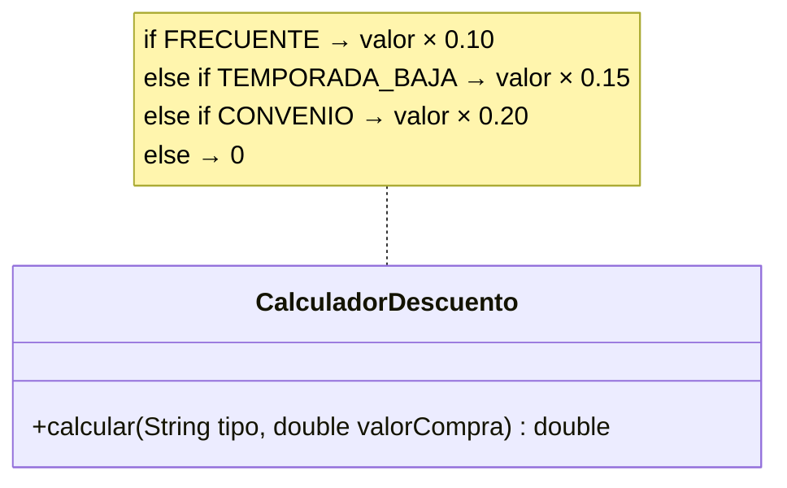
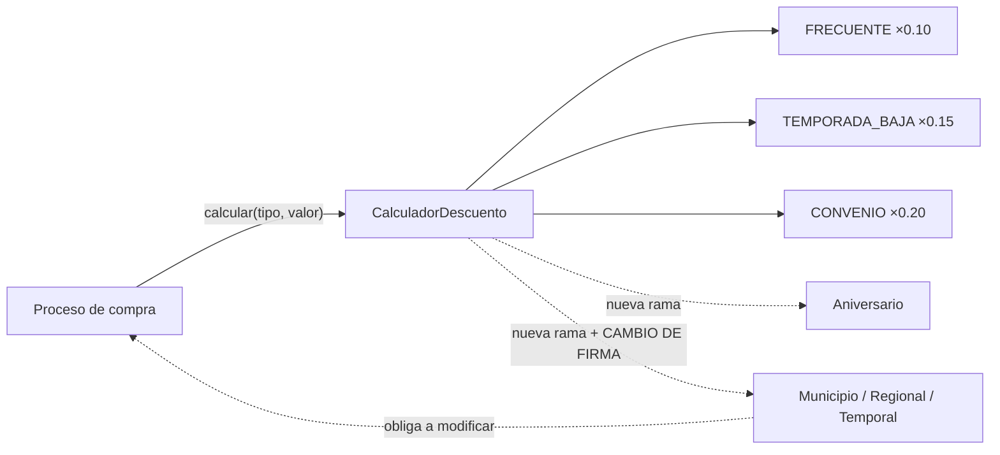
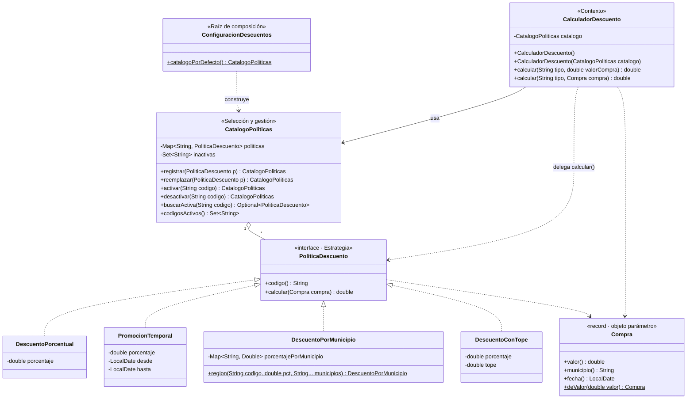
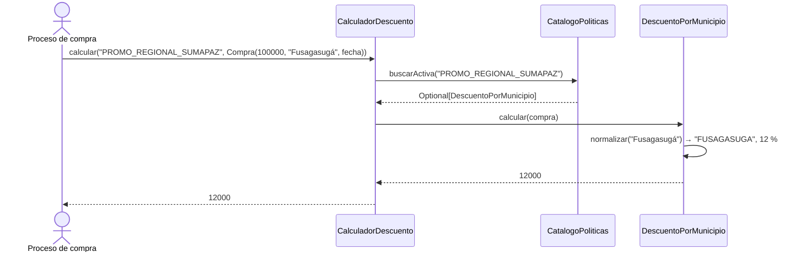
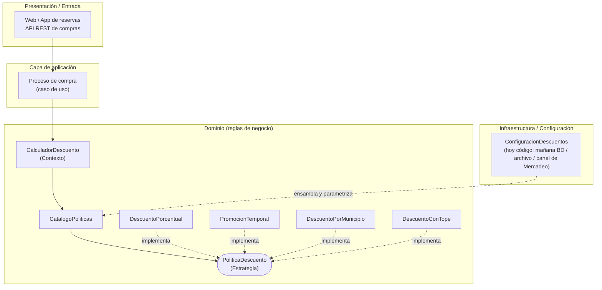

# Caso 3 — Motor flexible de asignación de descuentos (TurismoCundinamarca)

**Actividad:** R1-A2-S7 Patrones de arquitectura — Patrones GoF como soporte al diseño interno de componentes
**Categoría GoF del caso:** Comportamiento · **Patrón seleccionado:** Strategy (con catálogo de políticas)
**Marco de calidad de referencia:** ISO/IEC 25010:2023 e ISO/IEC 25023

> **Pregunta orientadora:** ¿Cómo permitir que los algoritmos de descuento cambien o sean reemplazados sin modificar continuamente el componente que procesa una compra?

**Respuesta corta:** cada política de descuento se convierte en una **estrategia** intercambiable detrás de la interfaz `PoliticaDescuento`. El `CalculadorDescuento`, que es el componente que usa el proceso de compra, solo **selecciona** la política activa de un catálogo y le delega el cálculo. Mercadeo puede **incorporar, reemplazar, activar o desactivar** políticas sin tocar el calculador. Las cinco políticas nuevas se implementaron con solo tres clases nuevas.

> **Nota sobre el código base:** `CalculadorDescuento` se transcribió del enunciado del caso. Si el zip *Motor_flexible_de_asignacion* trae clases adicionales (p. ej. un procesador de compras), estas solo necesitan seguir usando `CalculadorDescuento`, cuya API pública se conservó.

---

## Índice

1. [Análisis inicial](#1-análisis-inicial)
2. [Diagnóstico de diseño](#2-diagnóstico-de-diseño)
3. [Principios de diseño aplicables](#3-principios-de-diseño-aplicables)
4. [Alternativas y decisión fundamentada](#4-alternativas-y-decisión-fundamentada)
5. [Diseño propuesto](#5-diseño-propuesto)
6. [Implementación y trazabilidad](#6-implementación-y-trazabilidad)
7. [Validación con pruebas JUnit](#7-validación-con-pruebas-junit)
8. [Evaluación del impacto](#8-evaluación-del-impacto)
9. [Conexión arquitectónica y atributos de calidad](#9-conexión-arquitectónica-y-atributos-de-calidad)
10. [Respuestas a las preguntas de reflexión](#10-respuestas-a-las-preguntas-de-reflexión)

---

## 1. Análisis inicial

### 1.1 Funcionamiento actual

`CalculadorDescuento.calcular(tipo, valorCompra)` compara el texto `tipo` con tres literales y devuelve el **valor del descuento** (no el precio final):

| Tipo | Regla |
|---|---|
| `FRECUENTE` | `valorCompra * 0.10` |
| `TEMPORADA_BAJA` | `valorCompra * 0.15` |
| `CONVENIO` | `valorCompra * 0.20` |
| cualquier otro | `0` |

### 1.2 Clases, responsabilidades y dependencias

| Clase | Responsabilidades | Depende de |
|---|---|---|
| `CalculadorDescuento` | (1) Interpretar el tipo. (2) Conocer **qué** políticas existen. (3) Conocer **cómo** calcula cada una (porcentajes fijos). (4) Decidir el valor por defecto (0). | Nada externo: **todo el conocimiento de negocio está embebido** en el método |



### 1.3 Comportamiento observable (línea base)

| Entrada | Resultado observado |
|---|---|
| `("FRECUENTE", 100000)` | 10 000 |
| `("TEMPORADA_BAJA", 100000)` | 15 000 |
| `("CONVENIO", 100000)` | 20 000 |
| `("TEMPORADA_BAJA", 33.33)` | Exactamente `33.33 * 0.15`, **bit a bit** (4,999499…) |
| Valor 0 | 0 |
| `("CONVENIO", −1000)` | −200: **no valida** valores negativos |
| `"DESCONOCIDO"`, `""`, `"frecuente"`, `" FRECUENTE"` | 0, **sin excepción**. Distingue mayúsculas y no recorta espacios |
| Tipo `null` | `NullPointerException` |

> Que un tipo desconocido devuelva 0 **silenciosamente** es una decisión de negocio discutible, porque un error de digitación deja al cliente sin su descuento sin que nadie lo note. Se **conserva** y se deja como recomendación (§8.4).

---

## 2. Diagnóstico de diseño

### 2.1 Code smells identificados

| ID | Code smell | Ubicación | Evidencia | Consecuencia |
|---|---|---|---|---|
| CS1 | **Condicionales encadenados por tipo** (*Switch Statements*) | `calcular` | `if / else if / else if` sobre `tipo.equals(...)` | Cada política nueva agrega una rama. Complejidad ciclomática 4 hoy; llegaría a 9 con las 5 políticas anunciadas. |
| CS2 | **Algoritmos de negocio embebidos en el componente** | Cada rama | `valorCompra * 0.10`, `* 0.15`, `* 0.20` | Los algoritmos no se pueden reemplazar, reutilizar ni probar por separado. |
| CS3 | **Números mágicos** | `0.10`, `0.15`, `0.20` | Porcentajes de negocio escritos en el código | Mercadeo "cambiará las políticas frecuentemente", y cada cambio exige editar, compilar y desplegar. |
| CS4 | **Obsesión por primitivos / cadenas mágicas** | `String tipo` y sus literales | Los códigos solo existen dentro del `if` | No hay catálogo consultable de políticas. Un error de digitación da 0 en silencio. |
| CS5 | **Firma insuficiente para las reglas anunciadas** (*Primitive Obsession* en los parámetros) | `calcular(String tipo, double valorCompra)` | Las políticas por municipio, regionales y temporales necesitan **municipio y fecha** | Cada política nueva de ese tipo obligaría a **cambiar la firma** y a todos sus llamadores: el proceso de compra se modificaría continuamente. |
| CS6 | **Cambio divergente** | `CalculadorDescuento` | Cambia si llega una política, si cambia un porcentaje, si se suspende una campaña o si cambia la regla por defecto | Viola SRP. Alto riesgo de regresión en las políticas vigentes con cada campaña. |
| CS7 | **Sin mecanismo de activación** | Todo el componente | Activar o suspender una campaña exige editar código | No cumple el requisito de "activarse, reemplazarse o incorporarse". |
| CS8 | **Paquete por defecto** (menor) | `CalculadorDescuento.java` | Sin `package` | Limita la modularidad. Recomendación (§8.4). |

### 2.2 Causas del acoplamiento

**Pregunta central: ¿qué cambio futuro provocaría modificaciones en varias partes?** Cualquiera de los cinco anunciados por Mercadeo:

- **Aniversario** (como porcentaje fijo): nueva rama en el calculador. Se comprobó en la rama `demo/aniversario-sin-patron` (§8.2).
- **Municipio / regional / temporal**: no caben en la firma actual. Además de la rama, obligan a **cambiar la firma** de `calcular` y, en cascada, **el proceso de compra** que la invoca.
- **Cambiar un porcentaje o suspender una campaña**: editar el calculador y volver a desplegar.

Las causas son cuatro:

1. **El "qué" (qué política aplica) y el "cómo" (cómo se calcula) están fusionados** en un solo método.
2. **No existe una abstracción de "política de descuento"** que permita tratar los algoritmos como objetos intercambiables.
3. **Los datos de la compra se pasan como primitivos sueltos**, así que la firma no puede crecer sin romper a los llamadores.
4. **Los parámetros de negocio (porcentajes) son constantes del código** y no configuración.



---

## 3. Principios de diseño aplicables

| Principio | Violación actual | Orientación |
|---|---|---|
| **Abierto/Cerrado (OCP)** — *principal* | Cada política modifica el calculador. | Incorporar políticas **por extensión** (nuevas estrategias o configuración). |
| **Encapsular lo que varía** | Lo que más cambia (los algoritmos y sus parámetros) está mezclado con lo estable (el flujo). | Aislar cada algoritmo detrás de `PoliticaDescuento`. |
| **Responsabilidad única (SRP)** | El calculador conoce el catálogo, los algoritmos y los parámetros. | Algoritmo → estrategia. Catálogo y estado → `CatalogoPoliticas`. Parámetros → configuración. Coordinación → calculador. |
| **Inversión de dependencias (DIP)** | — | El calculador depende de la abstracción `PoliticaDescuento`. El catálogo se inyecta. |
| **Composición sobre herencia** | — | El calculador **compone** una política en lugar de tener subclases por tipo (alternativa A4 descartada). |
| **Separar datos de comportamiento** | Porcentajes como números mágicos (CS3). | Un **porcentaje es un dato**: tres políticas porcentuales son tres *instancias* de una misma estrategia, no tres clases. |

---

## 4. Alternativas y decisión fundamentada

### 4.1 Alternativas consideradas

| ID | Alternativa | Descripción |
|---|---|---|
| A1 | Mantener el diseño y agregar ramas | Diseño actual. |
| A2 | `enum TipoDescuento` con el porcentaje como atributo | Elimina los números mágicos, pero todo el catálogo queda fijo en el `enum`. |
| A3 | Tabla de datos `Map<String, Double>` (código → porcentaje) | Solución **por datos**, sin patrón. |
| A4 | Herencia: subclases de `CalculadorDescuento` | Una subclase por tipo de descuento. |
| A5 | Template Method | Esqueleto fijo (validar → porcentaje → tope) con pasos redefinibles. |
| **A6** | **Strategy + catálogo de políticas inyectado** | **Cada algoritmo es una estrategia. El contexto selecciona la activa del catálogo.** |
| A7 | Mapa de lambdas `Map<String, Function<Compra, Double>>` | Strategy "funcional" con mecanismos del lenguaje. |
| A8 | Chain of Responsibility | Cada política decide si aplica y, si no, pasa la solicitud a la siguiente. |
| A9 | State | El comportamiento cambia según el estado interno del objeto. |
| A10 | Motor de reglas externo (p. ej. Drools) o reglas en base de datos | Decisión de infraestructura o arquitectura. |

### 4.2 Matriz comparativa ponderada (1 = peor, 5 = mejor; en complejidad, 5 = poca complejidad)

| Criterio (peso) | A1 | A2 | A3 | A4 | A5 | **A6** | A7 | A8 | A9 | A10 |
|---|---|---|---|---|---|---|---|---|---|---|
| Acoplamiento (25 %) | 1 | 2 | 4 | 3 | 3 | **5** | 4 | 4 | 3 | 5 |
| Extensibilidad (25 %) | 1 | 2 | 2 | 3 | 3 | **5** | 4 | 4 | 3 | 5 |
| Mantenibilidad (20 %) | 2 | 3 | 4 | 2 | 3 | **5** | 3 | 3 | 3 | 3 |
| Testabilidad (15 %) | 2 | 3 | 4 | 3 | 3 | **5** | 4 | 3 | 3 | 2 |
| Complejidad introducida (15 %) | 5 | 5 | 5 | 3 | 3 | **3** | 4 | 2 | 2 | 1 |
| **Puntaje ponderado** | 1,95 | 2,80 | 3,65 | 2,80 | 3,00 | **4,70** | 3,80 | 3,35 | 2,85 | 3,55 |

### 4.3 Análisis de las alternativas más cercanas

- **A3 (tabla de porcentajes)** es la mejor opción **para las tres políticas actuales**: si todo fueran porcentajes fijos, bastaría con datos y no haría falta un patrón. Pero falla ante lo anunciado: por municipio, temporal y con tope son **algoritmos distintos**, no porcentajes distintos. La solución adoptada **incorpora la lección de A3**: los porcentajes se tratan como datos dentro de la estrategia `DescuentoPorcentual`.
- **A7 (lambdas)** es la forma funcional de Strategy y es válida. Se prefirieron clases porque las políticas nuevas tienen **configuración y validaciones propias** (vigencias, topes, normalización de municipios) que merecen nombre, pruebas y documentación. Además, cada estrategia **declara su código**, así que el catálogo no depende de claves repetidas.
- **A8 (Chain of Responsibility)** sería la opción correcta si en cada compra se **evaluaran o acumularan varias** políticas. El caso establece que "en cada operación se seleccionará **una** política aplicable". Si en el futuro se combinan descuentos, las estrategias actuales pueden encadenarse o componerse sin reescribirse.
- **A9 (State)** no aplica: el descuento no depende de transiciones del estado interno del calculador, sino de una elección externa (el tipo).
- **A5 (Template Method)** obliga a que todas las políticas compartan el mismo esqueleto, y "por municipio" o "temporal" no encajan de forma natural en él.
- **A10** es razonable si el negocio necesita que Mercadeo edite reglas complejas sin desarrolladores. Es una decisión arquitectónica mayor; el diseño elegido es compatible con ella (§9).

### 4.4 Decisión

Se adopta **Strategy**. El `CalculadorDescuento` es el **Contexto**, `PoliticaDescuento` la **Estrategia**, y cada algoritmo distinto una **Estrategia concreta**. Se complementa con tres elementos:

- Un **catálogo** (`CatalogoPoliticas`) para seleccionar, incorporar, reemplazar, activar y desactivar políticas en tiempo de ejecución.
- Un **objeto parámetro** (`Compra`) que permite a las políticas usar municipio y fecha **sin volver a cambiar la firma**.
- Una **raíz de composición** (`ConfiguracionDescuentos`).

---

## 5. Diseño propuesto

### 5.1 Diagrama de clases UML (adaptado al caso)



*(Versión PlantUML: `docs/uml/diseno-propuesto.puml`)*

### 5.2 Participantes del patrón en el caso concreto

| Rol GoF (Strategy) | Clase en el caso | Responsabilidad |
|---|---|---|
| **Context** | `CalculadorDescuento` | Componente que usa el proceso de compra. Obtiene la estrategia activa y le delega el cálculo. |
| **Strategy** | `PoliticaDescuento` | Contrato común de todos los algoritmos de descuento. |
| **ConcreteStrategy** | `DescuentoPorcentual`, `PromocionTemporal`, `DescuentoPorMunicipio`, `DescuentoConTope` | Un algoritmo distinto cada una. |
| *(apoyo)* | `CatalogoPoliticas` | Seleccionar por código y gestionar el ciclo de vida: incorporar, reemplazar, activar, desactivar. |
| *(apoyo)* | `Compra` | Objeto parámetro con los datos que las estrategias necesitan. |
| *(apoyo)* | `ConfiguracionDescuentos` | Único lugar donde se declaran las políticas vigentes y sus parámetros. |

**Mapeo de las ocho políticas a cuatro estrategias**, que muestra la diferencia entre "algoritmo" y "dato":

| Política de negocio | Estrategia concreta | Parámetros (ejemplo) |
|---|---|---|
| Cliente frecuente | `DescuentoPorcentual` | 10 % |
| Temporada baja | `DescuentoPorcentual` | 15 % |
| Convenio empresarial | `DescuentoPorcentual` | 20 % |
| Campaña de aniversario | `PromocionTemporal` | 25 %, octubre 2026 |
| Promociones temporales | `PromocionTemporal` | 18 %, 15 jun – 15 jul 2027 |
| Promoción regional (Sumapaz) | `DescuentoPorMunicipio.region(...)` | 12 % en los 10 municipios de la provincia |
| Descuentos por municipio | `DescuentoPorMunicipio` | Girardot 8 %, Zipaquirá 10 %, La Mesa 7 % |
| Alianzas con cajas de compensación | `DescuentoConTope` | 30 % con tope de 200 000 |

> Los porcentajes, fechas y topes de las políticas nuevas son **valores de ejemplo**; los reales los define Mercadeo en `ConfiguracionDescuentos`.

### 5.3 Secuencia de un cálculo



### 5.4 Gestión de políticas sin modificar el calculador

```java
CatalogoPoliticas catalogo = ConfiguracionDescuentos.catalogoPorDefecto();
CalculadorDescuento calculador = new CalculadorDescuento(catalogo);

catalogo.reemplazar(new DescuentoPorcentual("CONVENIO", 0.22));  // Mercadeo cambia un porcentaje
catalogo.desactivar("TEMPORADA_BAJA");                            // suspende una campaña
catalogo.registrar(new DescuentoConTope("CAJA_X", 0.25, 150_000)); // incorpora una alianza
```

### 5.5 Decisiones de detalle que preservan el comportamiento

- `DescuentoPorcentual` usa **exactamente** la misma expresión `valor * porcentaje`. Una prueba lo verifica **bit a bit**.
- Los códigos se buscan con igualdad exacta: **distinguen mayúsculas** y no recortan espacios, como `equals`.
- Si no hay política (o está inactiva), el resultado es **0**, como el `return 0` original.
- `buscarActiva(null)` lanza `NullPointerException`, como el original.
- La API pública `calcular(String, double)` se conserva y se **agrega** `calcular(String, Compra)`.
- Mejora sin impacto en el comportamiento vigente: las estrategias **validan su configuración** (porcentaje entre 0 y 1, vigencias coherentes, tope no negativo). Así se evita el error clásico de escribir `10` en lugar de `0.10`.

---

## 6. Implementación y trazabilidad

| Commit | Tag | Cambio | Pruebas |
|---|---|---|---|
| `chore: importar código original…` | `v0-original` | Código del enunciado + `pom.xml` | — |
| `test: pruebas de caracterización…` | `v1-linea-base` | 11 pruebas de línea base sobre el **original** | 11/11 ✅ |
| `refactor: extraer la estrategia PoliticaDescuento y el objeto parámetro Compra` | | Estrategia + `DescuentoPorcentual` + `Compra` | 11/11 ✅ |
| `refactor: eliminar el condicional con CatalogoPoliticas…` | | Catálogo + inyección + raíz de composición | 11/11 ✅ |
| `test: pruebas unitarias de estrategias, catálogo y contexto aislado` | `v2-refactor` | Estrategia, catálogo, contexto con doble, cambios en caliente | 26/26 ✅ |
| `feat: nuevo requisito - cinco políticas de Mercadeo` | `v3-nuevo-requisito` | 3 estrategias nuevas; 5 políticas configuradas | 33/33 ✅ |
| `docs: …` | | Informe, README, UML | 33/33 ✅ |
| rama `demo/aniversario-sin-patron` | | Aniversario agregado **sin patrón** (solo para comparar) | 11/11 ✅ |

---

## 7. Validación con pruebas JUnit

### 7.1 Estrategia

1. Las pruebas de caracterización se escribieron **antes** de refactorizar y se ejecutaron sobre el código original (`v1-linea-base`).
2. El archivo `CaracterizacionCalculadorDescuentoTest.java` **no cambia** en ningún commit. Se verifica con `git diff v1-linea-base main -- src/test/java/CaracterizacionCalculadorDescuentoTest.java`, que no muestra diferencias.
3. Una prueba verifica que la aritmética sea **idéntica bit a bit** (`assertEquals(33.33 * 0.15, …)` sin tolerancia), porque en cálculos monetarios con `double` cambiar el orden de las operaciones puede alterar el resultado.

### 7.2 Suites

| Suite | N.º | Qué valida |
|---|---|---|
| `CaracterizacionCalculadorDescuentoTest` | 11 | Tres modalidades, aritmética exacta, valor cero y negativo, desconocido, mayúsculas, espacios, vacío, null |
| `DescuentoPorcentualTest` | 3 | Cálculo y validación de porcentaje y código |
| `CatalogoPoliticasTest` | 8 | Incorporar, duplicados, reemplazar, inexistentes, activar/desactivar, estado tras reemplazo, listado, null |
| `CalculadorDescuentoAisladoTest` | 4 | Contexto con doble de prueba; **reemplazo y desactivación en caliente** |
| `NuevasPoliticasTest` | 7 | Nuevo requisito: aniversario, regional, municipio, temporal, caja con tope, validaciones, catálogo completo |

### 7.3 Resultados antes / después

| Momento | Código | Línea base (11) | Total |
|---|---|---|---|
| Antes | `v1-linea-base` (original) | 11/11 ✅ | 11/11 |
| Después | `v2-refactor` | 11/11 ✅ | 26/26 |
| Nuevo requisito | `v3-nuevo-requisito` | 11/11 ✅ | 33/33 |

> **Evidencia:** ejecutar `mvn test` en cada tag y adjuntar capturas, más el reporte JaCoCo.

---

## 8. Evaluación del impacto

### 8.1 Indicadores antes / después

| Indicador | Antes (`v0`) | Después (`v3`) | Lectura |
|---|---|---|---|
| Condicionales por tipo en el contexto | 3 | **0** | Se eliminó CS1 |
| Complejidad ciclomática de `calcular` | 4 | **1** | — |
| Crecimiento de la complejidad ciclomática por política nueva | +1 | **0** | — |
| Algoritmos de negocio dentro del contexto | 3 | **0** | Se eliminó CS2 |
| Números mágicos en el contexto | 3 | **0** | Se eliminó CS3 |
| ¿Se pueden usar municipio y fecha sin cambiar la firma? | **No** | **Sí** (`Compra`) | Se eliminó CS5 |
| Operaciones de gestión sin tocar código (incorporar, reemplazar, activar, desactivar) | 0 de 4 | **4 de 4** | Se eliminó CS7 |
| Clases nuevas para 5 políticas nuevas | — | **3** (reutilización de estrategias) | — |
| ¿El contexto se puede probar aislado? | No aplica (sin abstracción) | **Sí** (doble de prueba) | — |
| Pruebas automatizadas | 0 | **33** | — |
| Archivos de producción | 1 | 7 en `v2` · 10 en `v3` | **Costo** |
| Líneas no vacías de producción (con Javadoc) | 14 | 198 en `v2` · 326 en `v3` | **Costo** |
| Cobertura de líneas (JaCoCo) | 0 % | *completar con el reporte* | — |

### 8.2 Ejecución del nuevo requisito de cambio

| | Sin patrón (rama `demo/aniversario-sin-patron`) | Con Strategy (`main`) |
|---|---|---|
| Aniversario como porcentaje fijo | +4 líneas **en el calculador**; complejidad ciclomática 4 → 5 | 1 registro en la configuración |
| Aniversario **con vigencia**, municipio, regional | **Imposible sin cambiar la firma** de `calcular` y, por tanto, el proceso de compra | Soportado por `Compra`, sin cambiar la firma original |
| ¿Se modificó `CalculadorDescuento` para las 5 políticas? | Sí, en cada una | **No** (`git log v2-refactor..main -- src/main/java/CalculadorDescuento.java` devuelve 0 commits) |
| Archivos existentes modificados | — | Solo `ConfiguracionDescuentos` |
| Archivos nuevos | — | 3 estrategias (130 líneas, probadas de forma aislada) |

### 8.3 Beneficios y costos

**Beneficios**
- El calculador queda **estable** mientras las políticas cambian con frecuencia, que es exactamente lo que pide Mercadeo.
- Las políticas se gestionan en tiempo de ejecución: incorporar, reemplazar, activar y desactivar.
- **Reutilización**: 8 políticas de negocio con 4 estrategias. Solo se crea una clase cuando cambia el **algoritmo**, no el número.
- Cada algoritmo se prueba de forma aislada. El contexto se prueba con dobles.
- El objeto parámetro `Compra` absorbe datos futuros (canal, cantidad de viajeros…) sin tocar la firma.

**Costos**
- Más clases y archivos, y una capa de indirección.
- Hay que conocer el catálogo para saber qué políticas existen. Se mitiga con `codigosActivos()`.
- `Compra` puede crecer demasiado si se le agregan datos sin criterio. Conviene revisar sus campos periódicamente.
- El catálogo es mutable y compartido. Se usó `ConcurrentHashMap` para que los cambios en caliente sean seguros entre hilos.

**Conclusión:** el costo fijo es moderado frente al beneficio en un dominio que el propio caso describe como de **cambio frecuente**. Si las políticas fueran solo porcentajes estables, la tabla de datos (A3) habría sido suficiente.

### 8.4 Recomendaciones de evolución

1. Decidir con negocio si un tipo desconocido debe seguir dando 0 en silencio o registrarse o rechazarse. Hoy es un solo punto de cambio (`CalculadorDescuento.calcular`).
2. Usar `BigDecimal` para valores monetarios en un requisito aparte. Con `double` pueden aparecer residuos como 4,999499… (ver la prueba de aritmética exacta).
3. Cargar los parámetros de las políticas (porcentajes, vigencias, topes) desde configuración externa o base de datos. Las estrategias ya los reciben por constructor.
4. Si se requiere **combinar** descuentos, añadir una estrategia compuesta (Composite) o una cadena (Chain of Responsibility) sin cambiar el contexto.
5. Mover las clases a paquetes (CS8).

---

## 9. Conexión arquitectónica y atributos de calidad

### 9.1 Ubicación del patrón en la arquitectura (Clean Architecture / capas)

A diferencia del caso de logística, aquí las estrategias **no** son infraestructura. Son **reglas de negocio**, así que viven en el **dominio**. El patrón protege el núcleo de negocio de la volatilidad de las campañas comerciales.



- El proceso de compra depende **solo** del calculador (contexto estable). Las campañas cambian detrás de la interfaz de estrategia.
- La configuración está en el borde. Puede migrar a una base de datos o a un panel administrativo para Mercadeo **sin tocar el dominio**, lo que la hace compatible con la alternativa A10 como evolución.
- En frameworks modernos, Strategy se manifiesta como *providers* intercambiables. En Spring, por ejemplo, se inyecta una `List<PoliticaDescuento>` para construir el catálogo automáticamente. En microservicios, un "servicio de promociones" puede exponer este motor al resto de la plataforma.

### 9.2 Relación con ISO/IEC 25010:2023

| Característica · Subcaracterística | Evidencia en la solución | Medida sugerida (familia ISO/IEC 25023) |
|---|---|---|
| **Mantenibilidad · Modificabilidad** | 5 políticas nuevas sin modificar el contexto; porcentajes cambiables en caliente | Eficiencia y corrección de la modificación |
| **Mantenibilidad · Modularidad** | Un algoritmo por clase; contexto sin algoritmos | Acoplamiento entre componentes |
| **Mantenibilidad · Reusabilidad** | 8 políticas con 4 estrategias | Reutilización de activos |
| **Mantenibilidad · Analizabilidad** | Complejidad ciclomática del contexto = 1; cada regla con nombre propio | Adecuación de la complejidad ciclomática |
| **Mantenibilidad · Capacidad de prueba** | 33 pruebas; estrategias y contexto probados de forma aislada | Completitud de las funciones de prueba; capacidad de prueba autónoma |
| **Flexibilidad · Adaptabilidad** | Activar, desactivar y reemplazar políticas sin redesplegar el componente | Facilidad de adaptación |
| **Adecuación funcional · Corrección funcional** | Línea base de 11 pruebas en verde, con aritmética exacta bit a bit | Proporción de pruebas de regresión superadas |

> Este caso ejemplifica la **modificabilidad** en su sentido más puro: el negocio anuncia cambios frecuentes, y la arquitectura se prepara para que esos cambios sean **baratos, localizados y seguros**.

---

## 10. Respuestas a las preguntas de reflexión

- **¿Qué problema de diseño se observa realmente?** El componente que usa el proceso de compra contiene los algoritmos de descuento y la decisión de cuál aplicar. Además, su firma no admite los datos que requieren las nuevas políticas.
- **¿Qué evidencia muestra que dificulta el cambio?** Agregar el aniversario modificó el calculador (complejidad ciclomática 4→5), y las políticas por municipio o fecha ni siquiera caben sin cambiar la firma y a sus llamadores.
- **¿Qué principio orienta la mejora?** Abierto/Cerrado, apoyado en "encapsular lo que varía" y Responsabilidad única.
- **¿Qué alternativas existen antes de un patrón GoF?** Diez evaluadas (§4). La tabla de datos (A3) es ideal para porcentajes estables, y su lección se incorporó a `DescuentoPorcentual`.
- **¿Qué complejidad introduce el patrón?** Más clases, indirección, un catálogo que hay que conocer y un objeto parámetro que hay que cuidar (§8.3).
- **¿Cómo se demuestra que se mantiene la funcionalidad?** El mismo archivo de 11 pruebas, sin cambios y con verificación bit a bit, pasa antes y después.
- **¿Qué mejoró de forma observable?** La complejidad ciclomática del contexto pasó de 4 a 1; hay 0 algoritmos y 0 números mágicos en el contexto; 5 políticas se agregaron sin modificarlo; se pueden gestionar las políticas en caliente; hay 33 pruebas.
- **¿Cómo se relaciona con la arquitectura?** Las estrategias son reglas del **dominio** protegidas de la volatilidad comercial. La configuración queda en el borde y puede externalizarse. Favorece la modificabilidad, la reusabilidad y la adaptabilidad (ISO/IEC 25010:2023).

---

### Referencias

- Gamma, E. et al. (1994). *Design Patterns: Elements of Reusable Object-Oriented Software*. Addison-Wesley. (Strategy)
- Fowler, M. (2018). *Refactoring* (2.ª ed.). Addison-Wesley. (*Replace Conditional with Polymorphism*, *Introduce Parameter Object*)
- Martin, R. C. (2017). *Clean Architecture*. Prentice Hall.
- ISO/IEC 25010:2023 e ISO/IEC 25023:2016.
- Refactoring.Guru — Catálogo de patrones de diseño: Strategy.
