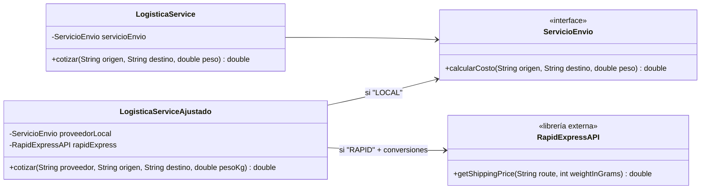
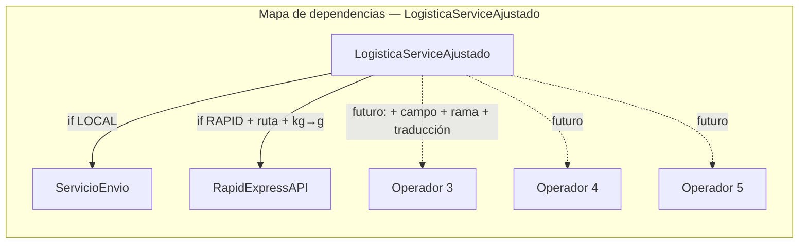
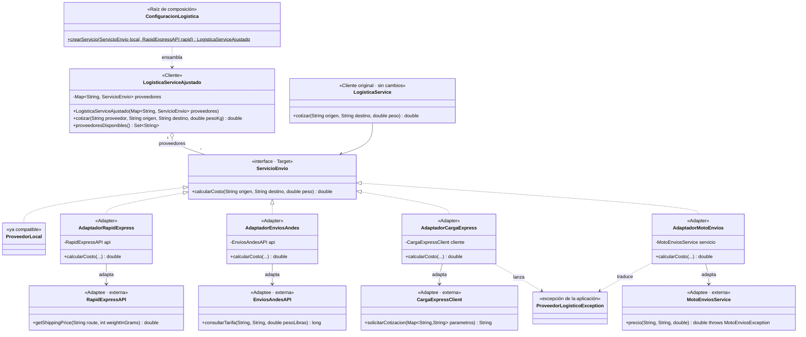
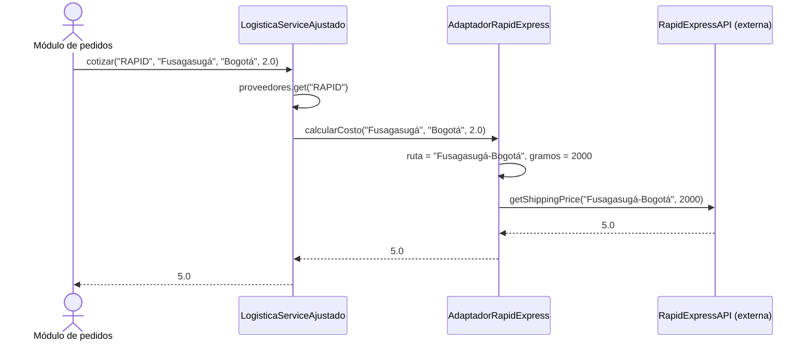
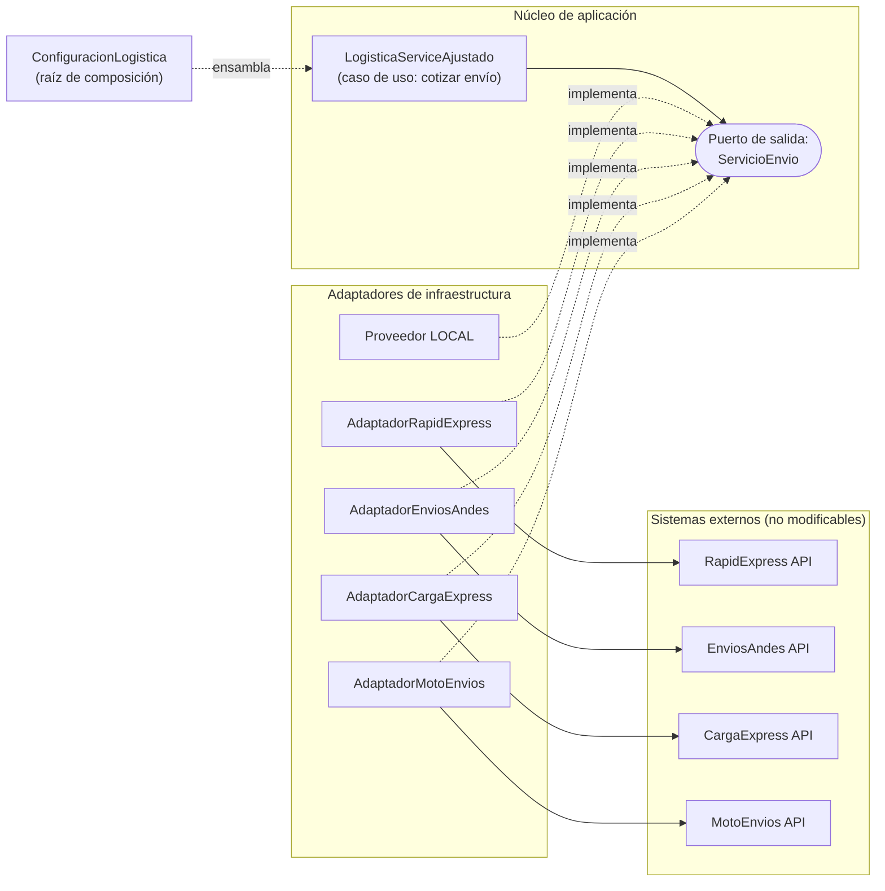

# Caso 2 — Integración con proveedores externos de logística (AgroConecta)

**Actividad:** R1-A2-S7 Patrones de arquitectura — Patrones GoF como soporte al diseño interno de componentes
**Categoría GoF del caso:** Estructural · **Patrón seleccionado:** Adapter (de objetos)
**Marco de calidad de referencia:** ISO/IEC 25010:2023 e ISO/IEC 25023

> **Pregunta orientadora:** ¿Cómo integrar proveedores con interfaces incompatibles sin contaminar la lógica principal con detalles particulares de cada API externa?

**Respuesta corta:** la aplicación ya tenía su propio contrato, `ServicioEnvio`. En lugar de enseñarle al servicio de logística a hablar el idioma de cada proveedor, se crea un **adaptador por proveedor** que traduce `ServicioEnvio` al API externo: unidades, formatos, nombres y excepciones. El servicio queda con una sola responsabilidad y sin `if` por proveedor. Los tres operadores nuevos se integraron **sin modificarlo**.

---

## Índice

1. [Análisis inicial](#1-análisis-inicial)
2. [Diagnóstico de diseño](#2-diagnóstico-de-diseño)
3. [Principios de diseño aplicables](#3-principios-de-diseño-aplicables)
4. [Alternativas y decisión fundamentada](#4-alternativas-y-decisión-fundamentada)
5. [Diseño propuesto](#5-diseño-propuesto)
6. [Implementación y trazabilidad](#6-implementación-y-trazabilidad)
7. [Validación con pruebas JUnit](#7-validación-con-pruebas-junit)
8. [Evaluación del impacto](#8-evaluación-del-impacto)
9. [Conexión arquitectónica y atributos de calidad](#9-conexión-arquitectónica-y-atributos-de-calidad)
10. [Respuestas a las preguntas de reflexión](#10-respuestas-a-las-preguntas-de-reflexión)

---

## 1. Análisis inicial

### 1.1 Funcionamiento actual

El proyecto contiene dos versiones del servicio de logística.

- **`LogisticaService`** (versión inicial). Recibe por constructor un `ServicioEnvio` y cotiza delegando en él. Está bien diseñada para **un** proveedor.
- **`LogisticaServiceAjustado`** (versión modificada por el equipo al firmar con RapidExpress). Recibe un código de proveedor. Si es `"LOCAL"`, delega en `ServicioEnvio`. Si es `"RAPID"`, **construye dentro del servicio** la ruta `origen-destino`, **convierte** kg a gramos enteros y llama a `RapidExpressAPI.getShippingPrice`. Cualquier otro código produce `IllegalArgumentException`.

`RapidExpressAPI` es una librería externa **no modificable**. Su firma es incompatible con `ServicioEnvio`: usa otro nombre de método, una ruta en un único texto y el peso en gramos enteros.

### 1.2 Clases, responsabilidades y dependencias

| Clase | Responsabilidades | Depende de |
|---|---|---|
| `ServicioEnvio` (interfaz) | Contrato de la aplicación: `calcularCosto(origen, destino, peso)` | — |
| `LogisticaService` | Cotizar delegando en un `ServicioEnvio` | `ServicioEnvio` (abstracción) ✅ |
| `LogisticaServiceAjustado` | (1) Seleccionar proveedor por texto. (2) Cotizar con LOCAL. (3) **Construir la ruta de Rapid.** (4) **Convertir kg→g.** (5) Invocar la API de Rapid. (6) Rechazar códigos desconocidos. | `ServicioEnvio` **y** `RapidExpressAPI` (clase concreta externa) ❌ |
| `RapidExpressAPI` | Cotizar según su propio contrato (simulado: gramos × 0,0025) | — |

### 1.3 Comportamiento observable (línea base)

| Entrada | Resultado observado |
|---|---|
| `("LOCAL", o, d, p)` | Delega en `ServicioEnvio` con los **mismos** argumentos y devuelve su valor |
| `("RAPID", "Fusagasugá", "Bogotá", 2.0)` | Ruta `"Fusagasugá-Bogotá"`, 2000 g, costo **5,0** |
| `("RAPID", …, 1.2345)` | 1234 g: las fracciones se **truncan** |
| `("RAPID", …, 1.005)` | **1004 g**, no 1005: artefacto de punto flotante (`1.005 × 1000 = 1004.999…`) |
| `("RAPID", …, −1.0)` | −1000 g y costo −2,5: **no valida** pesos negativos |
| `("RAPID", …, 1e7)` | `Integer.MAX_VALUE` g: el `int` **se satura** |
| `("local", …)`, `("DESCONOCIDO", …)` | `IllegalArgumentException`: el código **distingue mayúsculas** |
| Proveedor `null` | `NullPointerException` |
| **Cualquier cotización válida con `new LogisticaServiceAjustado()`** | **`NullPointerException`: defecto latente** (ver CS1) |

> Los comportamientos discutibles (truncamiento, negativos, desbordamiento) se **conservan**. Corregirlos es un requisito aparte. La refactorización los ubica en **un solo lugar** (el adaptador), donde es fácil corregirlos después (§8.4).

---

## 2. Diagnóstico de diseño

### 2.1 Code smells identificados

| ID | Code smell / problema | Ubicación | Evidencia | Consecuencia |
|---|---|---|---|---|
| CS1 | **Dependencias nunca inicializadas (defecto latente)** | `LogisticaServiceAjustado`, campos `proveedorLocal`, `rapidExpress` | No hay constructor ni *setters*. Con `new LogisticaServiceAjustado()` toda cotización válida lanza `NullPointerException` (probado en `DefectoDependenciasNoInicializadasTest`, tag `v1-linea-base`). | La clase **no funciona ni se puede probar** sin reflexión. Síntoma de haber modificado el servicio "a mano" sin pruebas. |
| CS2 | **Condicionales por proveedor** (*Switch Statements*) | `cotizar`: `if ("LOCAL")`, `if ("RAPID")` | Cada operador nuevo agrega una rama | Complejidad ciclomática 3 hoy; llegaría a 6 con los tres operadores anunciados. |
| CS3 | **Detalles de una API externa filtrados a la lógica principal** | Rama `RAPID` | `origen + "-" + destino`, `(int) (pesoKg * 1000)`, `getShippingPrice` | El servicio conoce el formato de ruta y la unidad de peso de un tercero. Si RapidExpress cambia su API, cambia el núcleo. |
| CS4 | **Dependencia rígida de una clase concreta externa** | Campo `RapidExpressAPI rapidExpress` | El cliente depende del *Adaptee* y no de la abstracción | Viola DIP. No se puede sustituir ni simular Rapid sin tocar el servicio. |
| CS5 | **Cambio divergente / clase que crecerá sin control** | `LogisticaServiceAjustado` | Cambia si llega un proveedor, si un proveedor cambia su API o si cambia la regla de selección | Con 5 proveedores tendría 5 campos, 5 ramas y 4 bloques de traducción: una clase "Dios" de integración. |
| CS6 | **Obsesión por primitivos / cadenas mágicas** | Literales `"LOCAL"`, `"RAPID"` y `String proveedor` | Códigos dispersos en el `if` | Errores de digitación solo en ejecución. No se pueden consultar los proveedores disponibles. |
| CS7 | **Excepción sin información** | `throw new IllegalArgumentException()` | Sin mensaje | Diagnóstico difícil en producción: no indica qué código llegó. |
| CS8 | **Parámetro con unidad implícita** | `ServicioEnvio.calcularCosto(…, double peso)` vs. `pesoKg` | La interfaz no dice la unidad; el servicio ajustado asume kg | Riesgo de errores de unidades con cada proveedor. Se documenta la convención (kg) en los adaptadores. |
| CS9 | **Convención de paquete** (menor) | `package Integracion_con_proveedores` | Mayúsculas y guiones bajos en el paquete | Contrario a la convención Java. Se conserva por compatibilidad con el enunciado. |

### 2.2 Causas del acoplamiento

**Pregunta central: ¿qué cambio futuro provocaría modificaciones en varias partes?** La integración de los **tres operadores adicionales** ya anunciados. Con el diseño actual, cada uno exige un campo nuevo, una rama nueva y su código de traducción **dentro** de `LogisticaServiceAjustado`. Se comprobó en la rama `demo/andes-sin-patron`: integrar un solo operador añadió 15 líneas al servicio (§8.2).

Las causas son cuatro:

1. **La responsabilidad de traducir** entre la interfaz de la aplicación y la del proveedor se asignó al servicio de negocio.
2. **El servicio depende del API externo concreto** en vez de hacerlo solo de `ServicioEnvio`, que ya existía y era la abstracción correcta.
3. **La selección del proveedor es condicional** y está mezclada con la traducción.
4. **No hay inyección de dependencias** (CS1): el servicio no puede recibir sus colaboradores.

---

## 3. Principios de diseño aplicables

| Principio | Violación actual | Orientación |
|---|---|---|
| **Inversión de dependencias (DIP)** — *principal* | El servicio depende de `RapidExpressAPI` (detalle externo). | Depender solo de `ServicioEnvio`, la abstracción que la aplicación **ya definió**. |
| **Abierto/Cerrado (OCP)** | Cada operador modifica el servicio. | Extender con adaptadores nuevos sin modificar el servicio. |
| **Responsabilidad única (SRP)** | El servicio selecciona, traduce e invoca. | Traducir → adaptador. Seleccionar → mapa inyectado. Ensamblar → configuración. |
| **Encapsulación / ocultamiento de información** | Unidades y formatos de terceros están visibles en el núcleo. | Cada adaptador oculta los detalles de *su* proveedor. |
| **Composición sobre herencia** | — | Adaptador **de objetos** (compone la API) en lugar de adaptador de clases (hereda de ella). |

---

## 4. Alternativas y decisión fundamentada

### 4.1 Alternativas consideradas

| ID | Alternativa | Descripción |
|---|---|---|
| A1 | Mantener `LogisticaServiceAjustado` y agregar ramas | Diseño actual, más un campo y una rama por operador. |
| A2 | Modificar la librería externa | **Prohibido** por el caso: la librería no puede modificarse. |
| A3 | Extraer conversiones a una clase utilitaria estática | Reduce el código en las ramas, pero conserva los `if` y la dependencia del API. |
| A4 | **Adapter de clases** (`extends RapidExpressAPI implements ServicioEnvio`) | Traduce por herencia. |
| **A5** | **Adapter de objetos + inyección de un `Map<String, ServicioEnvio>`** | **Un adaptador por proveedor que compone su API. El servicio solo conoce `ServicioEnvio`.** |
| A6 | Adaptador con lambda (`ServicioEnvio` tiene un solo método) | `(o, d, p) -> api.getShippingPrice(o + "-" + d, (int) (p * 1000))` |
| A7 | Facade de logística que envuelve todas las APIs | Una clase que conoce a todos los proveedores. |
| A8 | Bridge | Separa una abstracción y su implementación cuando **ambas** varían. |
| A9 | Middleware de integración o API Gateway (p. ej. Apache Camel) | Decisión de nivel arquitectónico, no de clases. |

### 4.2 Matriz comparativa ponderada (1 = peor, 5 = mejor; en complejidad, 5 = poca complejidad)

| Criterio (peso) | A1 | A2 | A3 | A4 | **A5** | A6 | A7 | A8 | A9 |
|---|---|---|---|---|---|---|---|---|---|
| Acoplamiento (25 %) | 1 | — | 2 | 4 | **5** | 5 | 2 | 4 | 5 |
| Extensibilidad (25 %) | 1 | — | 2 | 4 | **5** | 4 | 2 | 4 | 5 |
| Mantenibilidad (20 %) | 1 | — | 2 | 3 | **5** | 3 | 2 | 3 | 3 |
| Testabilidad (15 %) | 1 | — | 2 | 3 | **5** | 4 | 2 | 4 | 3 |
| Complejidad introducida (15 %) | 5 | — | 4 | 4 | **4** | 5 | 3 | 2 | 1 |
| **Puntaje ponderado** | 1,60 | **Descartada** | 2,30 | 3,70 | **4,85** | 4,20 | 2,15 | 3,55 | 3,90 |

### 4.3 Análisis de las alternativas más cercanas

- **A2** queda descartada por la restricción del caso. Además, aunque se pudiera, modificar código de terceros acopla la aplicación a una versión "parcheada".
- **A4 (Adapter de clases)** funciona con `RapidExpressAPI`, pero tiene tres problemas. Java solo permite heredar de **una** clase. La herencia expone todos los métodos públicos de la API al cliente. Y falla si una librería real declara sus clases `final` o solo entrega interfaces o fábricas. El adaptador de objetos no tiene estas limitaciones.
- **A6 (lambda)** es una opción válida para traducciones triviales, porque `ServicioEnvio` es una interfaz funcional. Se prefirió la clase porque los adaptadores reales **tienen lógica propia** que merece nombre, pruebas y documentación. Los nuevos operadores lo confirman: conversión de unidades, interpretación de una respuesta de texto y traducción de excepciones chequeadas.
- **A7 (Facade)** resuelve otro problema: simplificar un subsistema complejo. Una fachada que envuelva *todas* las APIs vuelve a concentrar el conocimiento de todos los proveedores en una sola clase, que es justo el problema de CS5.
- **A8 (Bridge)** es para jerarquías que varían en dos dimensiones independientes. Aquí solo varía la implementación del proveedor.
- **A9** es una decisión arquitectónica válida si la integración crece mucho (colas, reintentos, transformaciones). Excede un componente con 5 cotizadores.

### 4.4 Decisión

Se adopta **Adapter de objetos**: un adaptador por API externa que implementa `ServicioEnvio`. Se complementa con **inyección por constructor** de un `Map<String, ServicioEnvio>` en el cliente y una **raíz de composición** (`ConfiguracionLogistica`), que es el único lugar que conoce las APIs externas. El patrón responde directamente a la pregunta orientadora: los detalles de cada API quedan **fuera** de la lógica principal.

---

## 5. Diseño propuesto

### 5.1 Diagrama de clases UML (adaptado al caso)

*(Versión PlantUML: `docs/uml/diseno-propuesto.puml`)*

### 5.2 Participantes del patrón en el caso concreto

| Rol GoF (Adapter) | Clase en el caso | Responsabilidad |
|---|---|---|
| **Target** | `ServicioEnvio` | Interfaz que la aplicación entiende (ya existía). |
| **Client** | `LogisticaServiceAjustado` y también `LogisticaService` original | Cotizar usando solo `ServicioEnvio`. |
| **Adaptee** | `RapidExpressAPI`, `EnviosAndesAPI`, `CargaExpressClient`, `MotoEnviosService` | APIs externas incompatibles y no modificables. |
| **Adapter** | `AdaptadorRapidExpress`, `AdaptadorEnviosAndes`, `AdaptadorCargaExpress`, `AdaptadorMotoEnvios` | Traducen la llamada y la respuesta. |
| *(apoyo)* | `ConfiguracionLogistica` | Único lugar que conoce las APIs externas; ensambla los adaptadores. |
| *(apoyo)* | `ProveedorLogisticoException` | Excepción de la aplicación a la que se traducen los errores de terceros. |

**Qué traduce cada adaptador.** Muestra que el patrón aísla distintos *tipos* de incompatibilidad:

| Adaptador | Incompatibilidad resuelta |
|---|---|
| `AdaptadorRapidExpress` | Nombre del método, ruta en un solo texto, **kg → gramos enteros** |
| `AdaptadorEnviosAndes` | **kg → libras**, respuesta en **centavos (`long`) → pesos (`double`)** |
| `AdaptadorCargaExpress` | Parámetros → **mapa con claves en inglés**; respuesta **texto `"COP:<valor>"` → `double`** con validación del formato |
| `AdaptadorMotoEnvios` | **Excepción chequeada del proveedor → `ProveedorLogisticoException`** |

El proveedor LOCAL **no necesita adaptador**, porque ya implementa `ServicioEnvio`.

### 5.3 Secuencia de una cotización con RapidExpress

### 5.4 Decisiones de detalle que preservan el comportamiento

- El adaptador de Rapid usa **exactamente** la misma expresión, `(int) (peso * 1000)`, así que se conservan el truncamiento, el artefacto de 1,005 kg y la saturación.
- Se usa `Map.copyOf` con búsqueda exacta, así que el código **distingue mayúsculas** como `equals`.
- `Objects.requireNonNull(proveedor)` conserva la `NullPointerException` ante un proveedor `null`.
- El proveedor desconocido sigue lanzando `IllegalArgumentException`. **Único cambio deliberado:** ahora el mensaje indica el código recibido (CS7). No altera el tipo de la excepción ni el flujo del llamador.

---

## 6. Implementación y trazabilidad

| Commit | Tag | Cambio | Pruebas |
|---|---|---|---|
| `chore: importar código original…` | `v0-original` | Código entregado + `pom.xml` | — |
| `test: pruebas de caracterización…` | `v1-linea-base` | 10 de línea base + 1 del servicio original + 2 que **documentan el defecto CS1** | 13/13 ✅ |
| `refactor: extraer AdaptadorRapidExpress…` | | La traducción sale del servicio y pasa al adaptador | 13/13 ✅ |
| `refactor: inyectar proveedores como ServicioEnvio…` | | Constructor con `Map`, sin `if` por proveedor, raíz de composición. **Corrige CS1 por diseño.** | 11/11 ✅ (\*) |
| `test: pruebas unitarias del adaptador y del cliente aislado` | `v2-refactor` | Adaptador, uso con el `LogisticaService` original, cliente con dobles | 19/19 ✅ |
| `feat: nuevo requisito - integrar tres operadores…` | `v3-nuevo-requisito` | EnviosAndes, CargaExpress, MotoEnvios | 25/25 ✅ |
| `docs: …` | | Informe, README, UML | 25/25 ✅ |
| rama `demo/andes-sin-patron` | | Un operador agregado **sin patrón** (solo para comparar) | 13/13 ✅ |

(\*) Las 2 pruebas del defecto se retiran porque el constructor sin argumentos que lo provocaba **ya no existe**: el compilador impide reproducir el defecto.

---

## 7. Validación con pruebas JUnit

### 7.1 Estrategia

1. **Antes de refactorizar** se caracterizó el comportamiento. Como la clase no permitía inyectar dependencias (CS1), el objeto bajo prueba se ensambló **por reflexión**, una técnica estándar para caracterizar código legado.
2. El ensamblaje quedó aislado en **un único archivo de soporte**, `FabricaServicioBajoPrueba`. Después de la refactorización **solo ese archivo cambia** (pasa a usar `ConfiguracionLogistica`). El archivo `CaracterizacionLogisticaTest.java` **no se modifica**, lo que se verifica con `git diff v1-linea-base main -- src/test/java/Integracion_con_proveedores/CaracterizacionLogisticaTest.java`, que no muestra diferencias.
3. La librería externa **no se modifica** ni siquiera en pruebas: se usa `RapidExpressEspia`, una subclase de prueba que registra los argumentos y delega en el cálculo real.

### 7.2 Suites

| Suite | N.º | Qué valida |
|---|---|---|
| `CaracterizacionLogisticaTest` | 10 | LOCAL sin transformación; ruta, gramos y precio de RAPID; truncamiento, flotante, negativos, desbordamiento; mayúsculas, desconocido, null |
| `LogisticaServiceOriginalTest` | 1 | El servicio original delega sin transformar |
| `DefectoDependenciasNoInicializadasTest` | 2 | *(solo en `v1`)* documenta el defecto CS1 |
| `AdaptadorRapidExpressTest` | 3 | Traducción; uso con el **`LogisticaService` original sin modificarlo**; API obligatoria |
| `LogisticaServiceAisladoTest` | 5 | Cliente con dobles de `ServicioEnvio`: delegación, mensaje de error, copia defensiva, validación, configuración |
| `NuevosOperadoresTest` | 6 | Nuevo requisito: tres operadores y sus traducciones (unidades, formato, excepciones) |

### 7.3 Resultados antes / después

| Momento | Código | Línea base (10 + 1) | Total |
|---|---|---|---|
| Antes | `v1-linea-base` (original) | 11/11 ✅ | 13/13 |
| Después | `v2-refactor` | 11/11 ✅ | 19/19 |
| Nuevo requisito | `v3-nuevo-requisito` | 11/11 ✅ | 25/25 |

> **Evidencia:** ejecutar `mvn test` en cada tag y adjuntar capturas, más el reporte JaCoCo.

---

## 8. Evaluación del impacto

### 8.1 Indicadores antes / después

| Indicador | Antes (`LogisticaServiceAjustado`, `v0`) | Después (`v3`) | Lectura |
|---|---|---|---|
| Dependencias del cliente hacia APIs externas concretas | 1 (`RapidExpressAPI`) | **0** | Se eliminó CS4 |
| Líneas de traducción de APIs externas dentro del cliente | 4 (ruta, gramos, llamada) | **0** | Se eliminó CS3 |
| Complejidad ciclomática de `cotizar` | 3 | **2** (solo la guarda de "no soportado") | — |
| Crecimiento de la complejidad ciclomática por operador nuevo | +1 | **0** | — |
| Campos del cliente por operador | +1 por operador | **0** (un único mapa) | Se eliminó CS5 |
| ¿El cliente puede construirse y probarse sin reflexión? | **No** (defecto CS1) | **Sí** | Defecto corregido por diseño |
| ¿El `LogisticaService` original puede usar RapidExpress? | No | **Sí, sin modificarlo** | Beneficio directo del Adapter |
| Mensaje de error de proveedor no soportado | Vacío | Incluye el código | Se eliminó CS7 |
| Pruebas automatizadas | 0 | **25** | — |
| Archivos de producción | 4 | 6 en `v2` · 14 en `v3` (incluye 4 APIs externas simuladas) | **Costo** |
| Líneas no vacías de producción | 61 | 129 en `v2` · 268 en `v3` | **Costo** |
| Cobertura de líneas (JaCoCo) | 0 % | *completar con el reporte* | — |

### 8.2 Ejecución del nuevo requisito de cambio: "integrar EnviosAndes"

| | Sin patrón (rama `demo/andes-sin-patron`) | Con Adapter (`main`) |
|---|---|---|
| ¿Se modifica el servicio de logística? | **Sí**: +15 líneas (campo, rama, conversión a libras y a pesos) | **No** (`git log v2-refactor..main -- …/LogisticaServiceAjustado.java` devuelve 0 commits) |
| Complejidad ciclomática de `cotizar` | 3 → 4 | 2 → 2 |
| Dependencias externas del servicio | 1 → 2 | 0 → 0 |
| ¿Dónde vive la conversión kg→lb y centavos→pesos? | En la lógica principal | En `AdaptadorEnviosAndes` (24 líneas, probado de forma aislada) |
| Otros archivos existentes modificados | — | `ConfiguracionLogistica`: +1 línea de registro y +1 constante |

Para los **tres operadores**, el diseño refactorizado añadió 3 adaptadores y 1 excepción de aplicación, y solo tocó `ConfiguracionLogistica` (+6 líneas). Con el diseño original, el servicio habría llegado a 5 campos, 5 ramas y unas 45 líneas más de traducción mezcladas en un solo método.

### 8.3 Beneficios y costos

**Beneficios**
- La lógica principal queda libre de detalles de terceros. Esa es exactamente la pregunta orientadora.
- Los cambios en la API de un proveedor impactan **solo a su adaptador**.
- Cada adaptador se prueba de forma aislada. El cliente se prueba con dobles, sin APIs reales.
- Los errores de terceros se traducen a una excepción propia, así que el cliente no depende de las excepciones de cada librería.
- Se reutiliza la abstracción existente (`ServicioEnvio`): incluso el `LogisticaService` original gana soporte multiproveedor sin tocarlo.

**Costos**
- Una clase más por proveedor.
- Una capa de indirección: para depurar una cotización hay que pasar por el adaptador.
- La raíz de composición debe mantenerse. Si se olvida registrar un proveedor, falla en ejecución; se mitiga con la prueba `cincoProveedores`.
- Si una API es muy diferente (p. ej. asíncrona o por lotes), un adaptador 1 a 1 puede no bastar y requerir otra estrategia (§8.4).

**Conclusión:** con cinco proveedores de interfaces distintas, el Adapter convierte un problema que crecía dentro del núcleo en extensiones aisladas y probadas. El costo es de una clase pequeña por proveedor.

### 8.4 Recomendaciones de evolución

1. Corregir en `AdaptadorRapidExpress`, como requisito aparte y con su prueba, el truncamiento (`Math.round`) y la validación de pesos negativos o excesivos. Ahora es **un solo punto de cambio**.
2. Declarar la unidad en el contrato (p. ej. renombrar a `pesoKg` o usar un tipo `Peso`), resolviendo CS8.
3. Si hay reintentos o *timeouts* con proveedores reales, envolver los adaptadores con un Decorator (reintentos, caché, métricas) sin tocar el cliente.
4. Renombrar el paquete a minúsculas (`co.agroconecta.logistica`) en un commit dedicado (CS9).

---

## 9. Conexión arquitectónica y atributos de calidad

### 9.1 Ubicación del patrón en la arquitectura (hexagonal: puertos y adaptadores)

Este caso es la base de la **arquitectura hexagonal**: `ServicioEnvio` es un **puerto de salida** definido por la aplicación, y cada adaptador GoF es un **adaptador secundario** hacia un sistema externo. El patrón GoF (nivel de clases) y el estilo arquitectónico (nivel de sistema) comparten el nombre porque resuelven el mismo problema a escalas diferentes.

- **Las dependencias apuntan al núcleo:** los adaptadores conocen el puerto; el núcleo no conoce los adaptadores.
- En Domain-Driven Design, estos adaptadores funcionan como una **capa anticorrupción**: impiden que los modelos de los proveedores (rutas en texto, gramos, libras, excepciones propias) contaminen el modelo de AgroConecta.
- En microservicios, el mismo rol lo cumplen los clientes de integración o un servicio de "cotización logística" que expone una API única al resto de la plataforma.

### 9.2 Relación con ISO/IEC 25010:2023

| Característica · Subcaracterística | Evidencia en la solución | Medida sugerida (familia ISO/IEC 25023) |
|---|---|---|
| **Mantenibilidad · Modularidad** | 0 dependencias del cliente hacia APIs externas; un módulo por proveedor | Acoplamiento entre componentes |
| **Mantenibilidad · Modificabilidad** | 3 operadores integrados sin modificar el cliente (§8.2) | Eficiencia y corrección de la modificación |
| **Mantenibilidad · Analizabilidad** | Las particularidades de cada proveedor están en un solo archivo con nombre propio | Adecuación de la complejidad ciclomática |
| **Mantenibilidad · Capacidad de prueba** | Cliente probado con dobles; adaptadores probados de forma aislada; espía sin tocar la librería | Capacidad de prueba autónoma |
| **Compatibilidad · Interoperabilidad** | Cuatro APIs con contratos distintos operan tras un contrato común | Adecuación del intercambio de datos |
| **Flexibilidad · Reemplazabilidad** | Un proveedor se reemplaza cambiando una línea de configuración | Facilidad de reemplazo de componentes |
| **Flexibilidad · Adaptabilidad** | La plataforma se adapta a nuevos operadores por extensión | — |
| **Fiabilidad · Tolerancia a fallos** (parcial) | Los errores de terceros se traducen a una excepción controlada y con causa | — |
| **Adecuación funcional · Corrección funcional** | La línea base de 11 pruebas pasa antes y después; se corrigió el defecto CS1 | Proporción de pruebas de regresión superadas |

> En este caso el atributo destacado, además de la mantenibilidad, es la **interoperabilidad** (subcaracterística de *Compatibilidad* en ISO/IEC 25010): la capacidad de intercambiar información con sistemas de terceros. El Adapter es el mecanismo de diseño que la hace posible sin degradar la mantenibilidad.

---

## 10. Respuestas a las preguntas de reflexión

- **¿Qué problema de diseño se observa realmente?** La lógica principal asumió la responsabilidad de traducir entre su contrato y el de cada proveedor, y depende de APIs externas concretas. Además, las dependencias nunca se inicializan, así que la clase entregada no funciona.
- **¿Qué evidencia muestra que dificulta el cambio?** Un operador más añadió 15 líneas, un campo y una rama al servicio (complejidad ciclomática 3→4), y pasaría lo mismo con cada uno de los tres anunciados.
- **¿Qué principio orienta la mejora?** Inversión de dependencias (depender de `ServicioEnvio`), junto con Abierto/Cerrado y Responsabilidad única.
- **¿Qué alternativas existen antes de un patrón GoF?** Nueve evaluadas (§4). La lambda (A6) es válida para casos triviales, y el adaptador de clases (A4) es más frágil que el de objetos.
- **¿Qué complejidad introduce el patrón?** Una clase por proveedor, una capa de indirección y el mantenimiento de la configuración.
- **¿Cómo se demuestra que se mantiene la funcionalidad?** Con la misma suite de caracterización, sin cambios, en verde antes y después. Solo cambió el ensamblaje, aislado en un único archivo de soporte.
- **¿Qué mejoró de forma observable?** 0 dependencias externas en el cliente, 0 líneas de traducción en la lógica principal, 3 operadores integrados sin tocar el servicio, el defecto corregido y 25 pruebas.
- **¿Cómo se relaciona con la arquitectura?** Es la implementación a nivel de clases de los "puertos y adaptadores" de la arquitectura hexagonal y de una capa anticorrupción. Favorece la interoperabilidad, la modularidad y la modificabilidad.

---

### Referencias

- Gamma, E. et al. (1994). *Design Patterns: Elements of Reusable Object-Oriented Software*. Addison-Wesley. (Adapter)
- Feathers, M. (2004). *Working Effectively with Legacy Code*. Prentice Hall. (Pruebas de caracterización, costuras)
- Fowler, M. (2018). *Refactoring* (2.ª ed.). Addison-Wesley.
- Cockburn, A. (2005). *Hexagonal Architecture (Ports and Adapters)*.
- Evans, E. (2003). *Domain-Driven Design*. Addison-Wesley. (Capa anticorrupción)
- ISO/IEC 25010:2023 e ISO/IEC 25023:2016.
- Refactoring.Guru — Catálogo de patrones de diseño: Adapter.
